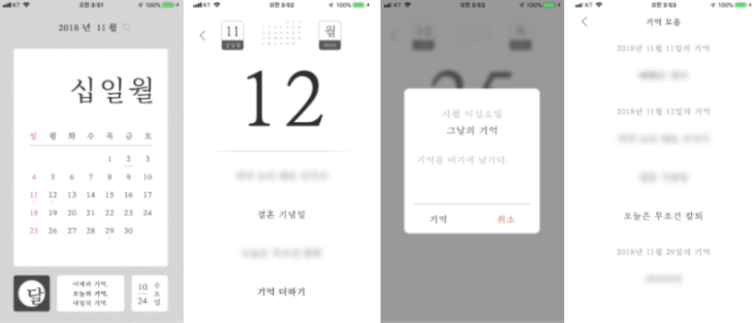
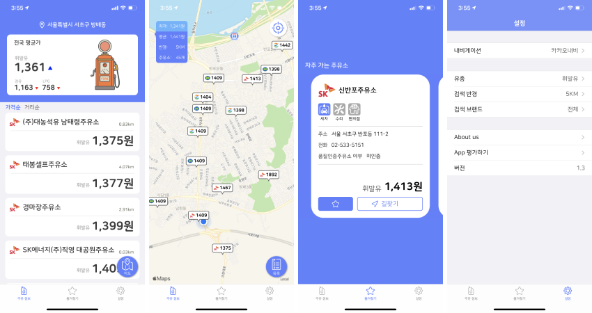
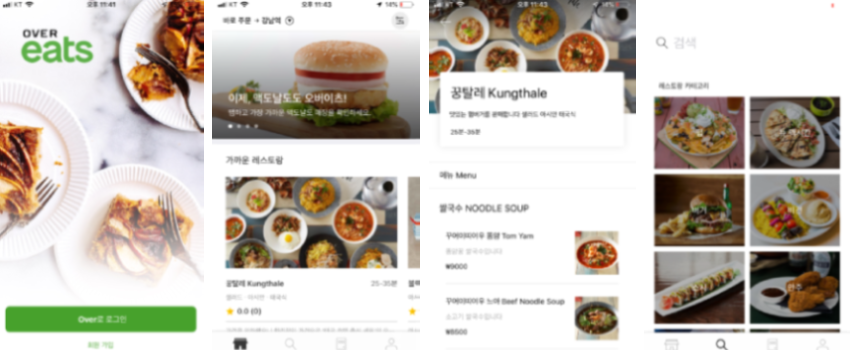
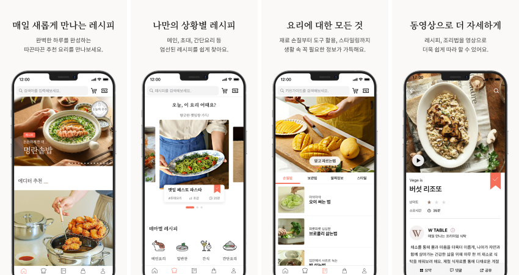
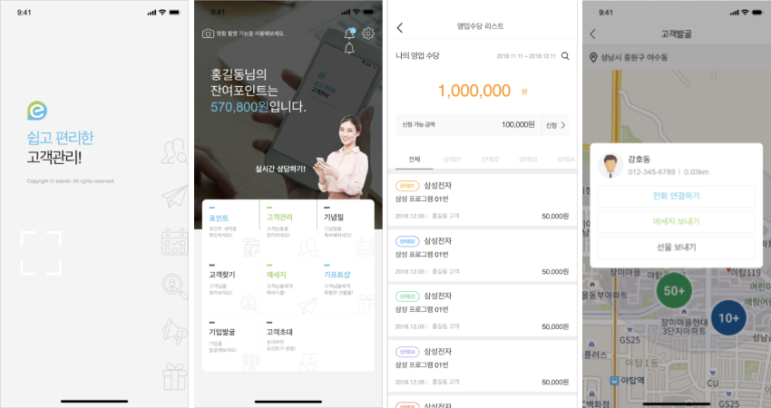
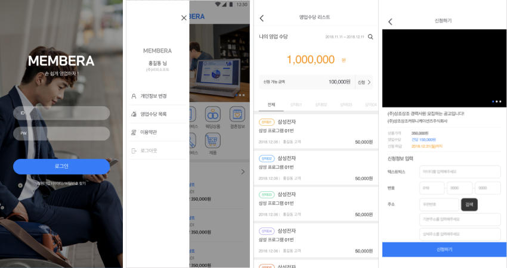

## 안솔찬

- Email: perudot@gmail.com
- Medium : https://medium.com/@perudot
- Github : https://github.com/solchan87

## 경력

[컬쳐히어로](https://culturehero.net/)

- iOS Developer(2019.03 ~ )

[비피소프트](https://www.jobaba.net/empmn/desEntDtl.do?bizrno=1578600071#)

- iOS Developer (2018.11 ~ 2019.01)

[팝콘파이브](http://www.popcorn5.com/#/)

- Backend Developer (2015.09 ~ 2016.9)

## 개인 프로젝트

### 그날

앱스토어까지 배포한 첫 iOS 프로젝트 입니다. 

- 기간 : 2018.08 ~ 2018.10

- 사용기술 :  Swift

- 자세한 정보 : [github](https://github.com/solchan87/Geunal)

 

### 주유어디

패스트캠퍼스 수료 후 앱스토어까지 배포한 첫 팀작업물입니다.

- 기간 : 2018.07 ~ 2018.08

- 사용기술 :  Swift

- 자세한 정보 : [github](https://github.com/OilPrice-Where/iOS-main)

 

### Over Eeats

패스트캠퍼스 수료 최종 결과물입니다.

- 기간 : 2018.04 ~ 2018.05

- 사용기술 :  Swift

- 자세한 정보 : [github](https://github.com/FastCampusTeamTwo/iOS)

 

## 회사 프로젝트

> ### 컬쳐히어로

### 우리의식탁(아내의 식탁)

400만 유저가 선택한 대한민국 대표 푸드 플랫폼

- 기간 : 2019.03 ~ 
- 역활 : iOS 개발
- 사용기술 : Swift, RxSwift, ReactorKit, RxFlow, Swiftlint SwiftUI
- AppStore : https://itunes.apple.com/kr/app/id1090371750?mt=8

 

> ### 비피소프트

### e단비

복지몰 고객들을 위한 영업관리 솔루션

- 기간 : 2018.11 ~ 2018.12
- 역활 : iOS 개발
- 사용기술 : Swift, RxSwift, ReactorKit

 

### Membera

영업사원과 고객의 매칭을 위한 솔루션

- 기간 : 2018.12 ~ 2019.01
- 역활 : iOS 개발
- 사용기술 : Swift, RxSwift, ReactorKit

 

## 세미나 발표

> ### let us: Go - 2020 Fall

Widget과 App Clip 개발 과정에서 겪었던 일들

[발표자료](https://perudot.medium.com/lets-us-go-%EC%9C%84%EC%A0%AF%EA%B3%BC-%EC%95%B1%ED%81%B4%EB%A6%BD-1568f2b6cab7)
